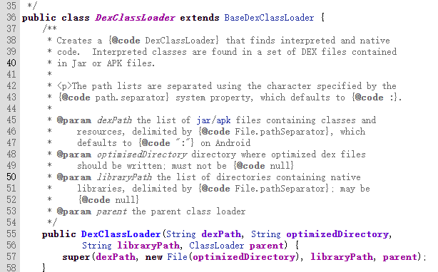
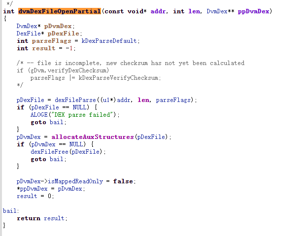
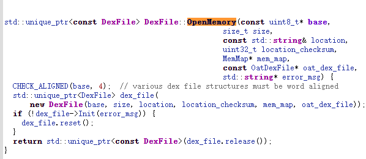
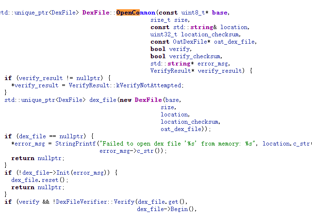

# 加壳

## 第一代壳 （落地）

android 4.0~4.4

原理实现：


从中有三个角色：

1.源apk: 被保护的apk [srcapk]

2.壳Apk:获得加密后的源apk,解密后用DexclassLoader动态加载

3.加壳程序：为源apk加密，把他放入壳中

classes.dex结构如下：

/1363336154_5208.png)

加壳程序：

1.加密源apk

2.把加密后的apk放在壳apk的classes.dex末端

3.修改壳的classes.dex的checksum,signature,file_size

壳apk：

1.读取自己classes.dex末尾的加密数据

2.解密获得源apk

3.动态加载源apk

**源apk**

没什么好说的，随便自己写，只不过得自定义一个Application类

/1.PNG)

**加密程序**

主要就是读取源apk,加密，放入壳的classes.dex，修改dex中固定位置的check num file_sizes,signature

**壳apk **

读取加密数据，解密获得apk，没什么好说的，不过是java的文件操作，关键是如何动态加载apk

就要先了解一下类加载器

classloader用于加载类的，对于安卓层面的话，就是用于加载dex文件,apk等文件

```
1.bootclassloader（加载android框架的）
2.pathclassloader（加载安装到android上的apk文件）
3.dexclassloader(可以加载自己的dex文件)，动态加载的关键点
4.baseclassloader(pathclassloader和dexclassloader的父类)
```

所以我们用dexclassloader来加载源apk。那么我们怎么让dexclassloder加载的apk有自己的启动流程

和生命周期，将我们的dexclassloader绑定到系统加载activity的类加载器： **替换LoadedApk中的mClassLoader**

看看activitythread ,它是所有app程序的入口，加载资源，app的application等作用

/2.PNG)


截取了activitythread的部分参数，可以看到在Activitythread.java中有个自身静态 sCurrentActivityThread,有一个ArrayMap存放Apk包名和LoadedApk映射关系的数据结构,其中的LoadedApk是用于加载apk的

/3.PNG)

loadedapk其中的mclassloader是用于加载apk的，所以我们只要替换一下就行了，通过sCurrentActivityThread得到activitythread,再得到mPackages,获得Loadedapk，再将我们自己的dexclassloader（继承自mclassloader的，不过是多了一个我们自己加载的apk）替换mclassloader

其中什么时候来执行该流程？ 要一个时机在脱壳程序还没运行起来的时候来加载源程序的apk,这个时机不能太晚，不然的话，就是运行脱壳程序，而不是源程序，application的attachbasecontext方法在application的on create方法执行前执行，所以就落在了attachbasecontext上了

加载好了，要怎么运行呢？activitythread有加载application的用处，activitythread原来的application是壳的application,所以我们只要将activitythread中和application有关参数改成源apk的就行了（源apk中自己定义的application用处），改mBoundAppication,minitialApplication,,mallapplication，loadapk的参,然后再app.oncreate()就行

**具体实现**

就说几个最关建的步骤

在attachbasecontext中替换LoadedApk中的mClassLoader

```java
 Object currentActivityThread = RefInvoke.invokeStaticMethod("android.app.ActivityThread","currentActivityThread",new Class[]{},new Object[]{});   //获得activitythread
        String packageName = this.getPackageName();
        ArrayMap mPackages = (ArrayMap) RefInvoke.getFieldOjbect("android.app.ActivityThread",currentActivityThread,"mPackages");
        WeakReference weakReference = (WeakReference) mPackages.get(packageName);//得到mPackages

        DexClassLoader newDexClassLoader = new DexClassLoader(mSrcApkAbsolutePath,mDexAbsolutePath,mLibAbsolutePath,
                (ClassLoader) RefInvoke.getFieldOjbect("android.app.LoadedApk",weakReference.get(),"mClassLoader"));//加载源apk的dexclassloader
 
         RefInvoke.setFieldOjbect("android.app.LoadedApk","mClassLoader",weakReference.get(),newDexClassLoader); //替换

```

在壳apk的oncreate中修改与application相关的参数

```java

        Object currentActivityThread = RefInvoke.invokeStaticMethod("android.app.ActivityThread","currentActivityThread"
        ,new Class[]{},new Object[]{});
        Object mBoundApplication = RefInvoke.getFieldOjbect("android.app.ActivityThread",currentActivityThread,
                "mBoundApplication");
        Object loadedApkInfo = RefInvoke.getFieldOjbect("android.app.ActivityThread$AppBindData",mBoundApplication
        ,"info");
        //将原来的loadedApkinfo mapplication置空
        RefInvoke.setFieldOjbect("android.app.LoadedApk","mApplication",loadedApkInfo,null);
```

更新2处`className`

```java
 //获取壳线程的application
        Object oldApplication = RefInvoke.getFieldOjbect("android.app.ActivityThread",currentActivityThread,
                "mInitialApplication");
        ArrayList<Application> mAllApplications = (ArrayList<Application>) RefInvoke.getFieldOjbect(
                "android.app.ActivityThread", currentActivityThread, "mAllApplications"
        );
        //移除原来的application
        mAllApplications.remove(oldApplication);
        //构造新的application
        ApplicationInfo appinfo_In_LoadedApk = (ApplicationInfo) RefInvoke.getFieldOjbect("android.app.LoadedApk", loadedApkInfo, "mApplicationInfo");
        ApplicationInfo appinfo_In_AppBindData = (ApplicationInfo) RefInvoke.getFieldOjbect("android.app.ActivityThread$AppBindData", mBoundApplication, "appInfo");
        appinfo_In_LoadedApk.className = srcAppClassName;//替换
        appinfo_In_AppBindData.className = srcAppClassName;
```

```java
    //注册application
   //注册application(用LoadedApk中的makeApplication方法注册)。
        Application app = (Application) RefInvoke.invokeMethod(
                "android.app.LoadedApk","makeApplication",loadedApkInfo,
                new Class[]{boolean.class, Instrumentation.class}, new Object[]{false,null}
        );
       //替换activityThread中的mInitialApplication
       //替换mInitialApplication为刚刚创建的app。
        RefInvoke.setFieldOjbect("android.app.ActivityThread", "mInitialApplication", currentActivityThread, app);
       //替换之前的内容提供者为刚刚注册的app
        ArrayMap mProviderMap = (ArrayMap) RefInvoke.getFieldOjbect("android.app.ActivityThread", currentActivityThread, "mProviderMap");
      //更新ContentProvider。
        Iterator it = mProviderMap.values().iterator();
        while (it.hasNext()) {
            Object providerClientRecord = it.next();
            Object localProvider = RefInvoke.getFieldOjbect("android.app.ActivityThread$ProviderClientRecord", providerClientRecord, "mLocalProvider");
            RefInvoke.setFieldOjbect("android.content.ContentProvider", "mContext", localProvider, app);
        }
```

之后就好了，还有个问题，就是资源加载问题，我们是将apk加载了，但是没处理资源，假如apk用了相关的资源，就崩溃了，当然可以通过反射加载资源，不过又要花大量篇幅讲了，所以为了从简，直接把源apk的资源替换掉壳apk的资源，毕竟壳apk的作用就是解壳，运行源apk，它的资源也没有用到

## 第二代壳(不落地) dal时代

适用版本：4.0~4.3

**背景知识：**





​                   dexclassloader调用了父类BaseDexClassloader构造

​       

   /2.PNG)

baseDexClassLoder构造中，将 dexpath传入dexpathlist,继续跟踪

/3.PNG)

​    其中dexpath传入makeDexElements,创造了dexelements数组，继续跟踪

​     /4.PNG)

  如果是dex文件。调用loadDexfile

/5.PNG)

调用DexFile.loadDex()

/6.PNG)

调用构造了新的Dexfile

/7.PNG)

调用了openDexfile函数，返回一个mcookie,是每个dexfile特有的，openDexfile又

调用 了native的opendexfile

/8.PNG)

而opendexfile有两种形式，第一个转dex文件，而第二个传bytearray,其中第二个是不落地壳的关键


通过查看源码，我们了解了dexclassloader的加载dex过程，其中的关键是opendexfile（c++)层的，返回了一个mcookie值，至于后面的mcookie有什么用，下面会介绍,opendefile支持file和bytearray两种模式，为了实现不落地加载壳，我们可以自己编写一个dexclassloader，让它调用dalvik_dalvik_system_Dexfile_openDexFile_bytearray,保存mcookie值


**(二)dexclassloader的loadclass方法**

dexclassloader是调用baseclassloader的loadclass,而baseclassloader并没有重写，实际就是调用classloader的loadclass

/9.PNG)

可以看到首先findloadedclass查找这个类是否已经加载过，没有的话，再看看自己的父类有没有加载过，这就是双亲委派机制，在这一条继承路上，只要有一个classloader已经load了，就不需要再load了,之后假如这一路上没有一个classloader加载了这个类，调用了findclass方法

/10.PNG)

baseclassloader调用了pathlist的findclass方法

/11.PNG)

pathlist的findclass方法：首先遍历那个makedexelements生成的数组，没有的话，调用dex.loadClassBinaryName方法

/12.PNG)

loadclassBinaryName又调用defineClass方法，而defineclass又调用c++层面的defineclass,就不放图了，注意mcookie在这里有用了

对此，我们明白了dexclassloader的loadlclass方法，主要是调用defineclass,而defineclass通过mcookie找到对应的dexfile,来进行加载的

将dexclassloader的构造结合起来看，dexfile是加载类的关键，opendexfile调用返回的mcookie值被用来loadclass,作为defineclass的参数

### **实现：**

将源程序的classes.dex文件加密后，以数组的形式存放在壳apk中，用我们自己写的dexclassloader加载，再替换LoadedApk中的mClassLoader，再用我们自己写的dexclassloader的loadclass，得到class，再start就行了

```
public class MyDexClassLoader extends DexClassLoader {
    public MyDexClassLoader(byte bytes[],
                            String dexPath,
                            String optimizedDirectory,
                            String librarySearchPath,
                            ClassLoader parent) {
        super(dexPath, optimizedDirectory, librarySearchPath, parent);

        createDexClassLoader(bytes,parent);

    }
```

让它继承自dexclassloader，构造函数中createDexclassloader

```
    private ClassLoader mClassLoader;
    private int mCookie;
    private void createDexClassLoader(byte[] bytes, ClassLoader parent) {
        // android 4.1 DexFile.openDexFile(byte[])
        mClassLoader = parent;
        try {
            // 1. 获取  DexFile 类类型
            Class clz = Class.forName("dalvik.system.DexFile");
            // 2. 获取 openDexFile 方法对象
            Method method = clz.getDeclaredMethod("openDexFile",byte[].class);
            // 3. 调用方法，返回 cookie
            method.setAccessible(true);
            mCookie = (int) method.invoke(null,new Object[]{bytes});
        } catch (Exception e) {
            e.printStackTrace();
        }
    }
```

通过反射调用dalvik_dalvik_system_Dexfile_openDexFile_bytearray保存mcookie

```
@Override
public Class<?> loadClass(String name) throws ClassNotFoundException {
    // android 4.1 DexFile.defineClass(String name, ClassLoader loader, int cookie)
    Class c = null;
    try {
        // 获取加载的类信息
        Class dexFile = Class.forName("dalvik.system.DexFile");
        // 获取静态方法
        Method method = dexFile.getDeclaredMethod("defineClass", String.class, ClassLoader.class, int.class);
        method.setAccessible(true);
        // 调用
        c = (Class)method.invoke(null,name, mClassLoader, mCookie);
        return c;
    } catch (Exception e) {
        // TODO Auto-generated catch block
        e.printStackTrace();
    }
    return super.loadClass(name);
}
```

loadclass反射调用defineclass，传入mcookie


```
  // 1. 获取ActivityThead类对象
            // android.app.ActivityThread
            // 1.1 获取类类型
            Class clzActivityThead = Class.forName("android.app.ActivityThread");
            // 1.2 获取类方法
            Method currentActivityThread = clzActivityThead.getMethod("currentActivityThread",new Class[]{});
            // 1.3 调用方法
            currentActivityThread.setAccessible(true);
            Object objActivityThread = currentActivityThread.invoke(null);

            // 2. 通过类对象获取成员变量mBoundApplication
            //clzActivityThead.getDeclaredField()
            Field field = clzActivityThead.getDeclaredField("mBoundApplication");
            // AppBindData
            field.setAccessible(true);
            Object data = field.get(objActivityThread);
            // 3. 获取mBoundApplication对象中的成员变量info
            // 3.1 获取 AppBindData 类类型
            Class clzAppBindData = Class.forName("android.app.ActivityThread$AppBindData");
            // 3.2 获取成员变量info
            Field field1 = clzAppBindData.getDeclaredField("info");
            // 3.3 获取对应的值
            //LoadedApk
            field1.setAccessible(true);
            Object info = field1.get(data);
            // 4. 获取info对象中的mClassLoader
            // 4.1 获取 LoadedApk 类型
            Class clzLoadedApk = Class.forName("android.app.LoadedApk");
            // 4.2 获取成员变量 mClassLoader
            Field field2 = clzLoadedApk.getDeclaredField("mClassLoader");
            field2.setAccessible(true);

            // 5. 替换ClassLoader
            field2.set(info,dexClassLoader);
```

替换LoadedApk中的mClassLoader

## 第二代壳 dal时代  jni编写

原理就不说了，和上面的一样

**实现：**

主要参考了一些文章的

.h文件 定义了一些结构和声明了一些函数

```java
/* DO NOT EDIT THIS FILE - it is machine generated */
#include <jni.h>
#include <cstdlib>
#include <cstdio>
#include <cstring>
#include <dlfcn.h>
#include <android/log.h>
union JValue {
    u_char z;
    char b;
    u_short c;
    short s;
    int32_t i;
    int64_t j;
    float f;
    double d;
    void *l;
};

struct Object {
    /* ptr to class object */
    void*    clazz;
    /*
 * A word containing either a "thin" lock or a "fat" monitor.  See
 * the comments in Sync.c for a description of its layout.
 */
    uint32_t  lock;
};

struct ArrayObject : Object {
    /* number of elements; immutable after init */
    uint32_t              length;
    /*
 * Array contents; actual size is (length * sizeof(type)).  This is
 * declared as u8 so that the compiler inserts any necessary padding
 * (e.g. for EABI); the actual allocation may be smaller than 8 bytes.
 */
    uint64_t              contents[1];
};
#define LOG_TAG "TAG"
#define LOGD(...) __android_log_print(ANDROID_LOG_DEBUG,LOG_TAG ,__VA_ARGS__)
#define LOGI(...) __android_log_print(ANDROID_LOG_INFO,LOG_TAG ,__VA_ARGS__)
#define LOGW(...) __android_log_print(ANDROID_LOG_WARN,LOG_TAG ,__VA_ARGS__)
#define LOGE(...) __android_log_print(ANDROID_LOG_ERROR,LOG_TAG ,__VA_ARGS__)
#define LOGF(...) __android_log_print(ANDROID_LOG_FATAL,LOG_TAG ,__VA_ARGS__)
/* Header for class com_android_second_jni_MyClassLoader */

#ifndef _Included_com_android_second_jni_MyClassLoader
#define _Included_com_android_second_jni_MyClassLoader
#ifdef __cplusplus
extern "C" {
#endif
/*
 * Class:     com_android_second_jni_MyClassLoader
 * Method:    openDexFile
 * Signature: ([BI)I
 */
JNIEXPORT jint JNICALL Java_com_android_second_1jni_MyClassLoader_openDexFile
        (JNIEnv *, jobject , jbyteArray, jint);

#ifdef __cplusplus
}
#endif
#endif
```

.cpp文件中 

```java
typedef void (* OPEN_DEX_FILE)(const uint32_t * args,JValue * pResult);
OPEN_DEX_FILE g_openDexFile=NULL;

extern "C" JNIEXPORT jint JNI_OnLoad(JavaVM * vm,void * reversed){
    JNIEnv env;
    jint jRet = vm->GetEnv((void**) & env,JNI_VERSION_1_6);
    if(jRet != JNI_OK){
        return JNI_ERR;
    }

    g_openDexFile = (OPEN_DEX_FILE)(GetFunAddr("openDexFile","([B)I"));
    return JNI_VERSION_1_6;
}
//GetFunAddr主要功能是找到函数地址 arg1:函数名称 arg2:函数签名（起始也是smli的返回 参数的简写）
void* GetFunAddr(char * methoidName,char * sig){

    void * handle = dlopen("libdvm.so",RTLD_LAZY);

    LOGD("模块基址为：%p",handle);
    JNINativeMethod  * jniNativeMethod = (JNINativeMethod*)dlsym(handle,"dvm_dalvik_system_DexFile");//这个是个数组。。。
    /*
     * const DalvikNativeMethod dvm_dalvik_system_DexFile[] = {
519    { "openDexFile",        "(Ljava/lang/String;Ljava/lang/String;I)I",
520        Dalvik_dalvik_system_DexFile_openDexFile },
521    { "openDexFile",        "([B)I",
522        Dalvik_dalvik_system_DexFile_openDexFile_bytearray },
523    { "closeDexFile",       "(I)V",
524        Dalvik_dalvik_system_DexFile_closeDexFile },
525    { "defineClass",        "(Ljava/lang/String;Ljava/lang/ClassLoader;I)Ljava/lang/Class;",
526        Dalvik_dalvik_system_DexFile_defineClass },
527    { "getClassNameList",   "(I)[Ljava/lang/String;",
528        Dalvik_dalvik_system_DexFile_getClassNameList },
529    { "isDexOptNeeded",     "(Ljava/lang/String;)Z",
530        Dalvik_dalvik_system_DexFile_isDexOptNeeded },
531    { NULL, NULL, NULL },
     struct DalvikNativeMethod {
29    const char* name;
30    const char* signature;
31    DalvikNativeFunc  fnPtr;
32};
532};
533
     */
    LOGD("数组基址为%p",jniNativeMethod);
    int i = 0;
    JNINativeMethod * nativeMethod = NULL;
    do{
        nativeMethod = (jniNativeMethod + i++);
        LOGD("函数名称为：%s",nativeMethod->name);
        if(strcmp(nativeMethod->name,methoidName)== 0
        && strcmp(nativeMethod->signature,sig)== 0){
            break;
        }
    }while(nativeMethod->name != NULL);

    dlclose(handle);
    return  nativeMethod->fnPtr;
}
```

jni_onload获得opendexfile的函数地址

```c++
extern "C"
JNIEXPORT jint JNICALL
Java_com_android_second_1jni_MyClassLoader_openDexFile(JNIEnv *env, jobject instance, jbyteArray bytes_,
                                                       jint len) {

    jbyte *bytes = env->GetByteArrayElements(bytes_,NULL);

    ArrayObject *pObject = static_cast<ArrayObject*>(malloc(sizeof(ArrayObject) + len));

    pObject->length = len;
    memcpy(pObject->contents,bytes,len);
    uint32_t  args = {*(uint32_t*)&pObject};
    JValue jRet= {0};
    g_openDexFile(&args,&jRet);

    env->ReleaseByteArrayElements(bytes_,bytes,0);
    //返回cookied
    return jRet.i;
}
```

然后再进行包装

## 第二代壳 art时代

由于在art模式下 Dalvik_dalvik_system_DexFile_openDexFile_bytearray函数被彻底删除了 ，各路的厂商就想了额外的方法来实现动态加载，但都归结到

android的最底层c++层面

**（一）**

一种是hook libart(art模式下用的so)下的OpenMemory函数,将参数换成我们的dex

/1.PNG)

   和上文的dexclassloader构造一下，最终调用opendexfilenative 来获得mcookie 

/3.png)

在openfilenative里，opendexfilesFromoat是促成mcookie形成的关键，继续看

```java
std::vector<std::unique_ptr<const DexFile>> ClassLinker::OpenDexFilesFromOat(
903    const char* dex_location, const char* oat_location,
904    std::vector<std::string>* error_msgs) {
905  CHECK(error_msgs != nullptr);
906
907  // Verify we aren't holding the mutator lock, which could starve GC if we
908  // have to generate or relocate an oat file.
909  Locks::mutator_lock_->AssertNotHeld(Thread::Current());
910
911  OatFileAssistant oat_file_assistant(dex_location, oat_location, kRuntimeISA,
912     !Runtime::Current()->IsAotCompiler());
913
914  // Lock the target oat location to avoid races generating and loading the
915  // oat file.
916  std::string error_msg;
917  if (!oat_file_assistant.Lock(&error_msg)) {
918    // Don't worry too much if this fails. If it does fail, it's unlikely we
919    // can generate an oat file anyway.
920    VLOG(class_linker) << "OatFileAssistant::Lock: " << error_msg;
921  }
922
923  // Check if we already have an up-to-date oat file open.
924  const OatFile* source_oat_file = nullptr;
925  {
926    ReaderMutexLock mu(Thread::Current(), dex_lock_);
927    for (const OatFile* oat_file : oat_files_) {
928      CHECK(oat_file != nullptr);
929      if (oat_file_assistant.GivenOatFileIsUpToDate(*oat_file)) {
930        source_oat_file = oat_file;
931        break;
932      }
933    }
934  }
935
936  // If we didn't have an up-to-date oat file open, try to load one from disk.
937  if (source_oat_file == nullptr) {
938    // Update the oat file on disk if we can. This may fail, but that's okay.
939    // Best effort is all that matters here.
940    if (!oat_file_assistant.MakeUpToDate(&error_msg)) {
941      LOG(WARNING) << error_msg;
942    }
943
944    // Get the oat file on disk.
945    std::unique_ptr<OatFile> oat_file = oat_file_assistant.GetBestOatFile();
946    if (oat_file.get() != nullptr) {
947      // Take the file only if it has no collisions, or we must take it because of preopting.
948      bool accept_oat_file = !HasCollisions(oat_file.get(), &error_msg);
949      if (!accept_oat_file) {
950        // Failed the collision check. Print warning.
951        if (Runtime::Current()->IsDexFileFallbackEnabled()) {
952          LOG(WARNING) << "Found duplicate classes, falling back to interpreter mode for "
953                       << dex_location;
954        } else {
955          LOG(WARNING) << "Found duplicate classes, dex-file-fallback disabled, will be failing to "
956                          " load classes for " << dex_location;
957        }
958        LOG(WARNING) << error_msg;
959
960        // However, if the app was part of /system and preopted, there is no original dex file
961        // available. In that case grudgingly accept the oat file.
962        if (!DexFile::MaybeDex(dex_location)) {
963          accept_oat_file = true;
964          LOG(WARNING) << "Dex location " << dex_location << " does not seem to include dex file. "
965                       << "Allow oat file use. This is potentially dangerous.";
966        }
967      }
968
969      if (accept_oat_file) {
970        source_oat_file = oat_file.release();
971        RegisterOatFile(source_oat_file);
972      }
973    }
974  }
975
976  std::vector<std::unique_ptr<const DexFile>> dex_files;
977
978  // Load the dex files from the oat file.
979  if (source_oat_file != nullptr) {
980    dex_files = oat_file_assistant.LoadDexFiles(*source_oat_file, dex_location);
981    if (dex_files.empty()) {
982      error_msgs->push_back("Failed to open dex files from "
983          + source_oat_file->GetLocation());
984    }
985  }
986
987  // Fall back to running out of the original dex file if we couldn't load any
988  // dex_files from the oat file.
989  if (dex_files.empty()) {
990    if (oat_file_assistant.HasOriginalDexFiles()) {
991      if (Runtime::Current()->IsDexFileFallbackEnabled()) {
992        if (!DexFile::Open(dex_location, dex_location, &error_msg, &dex_files)) {
993          LOG(WARNING) << error_msg;
994          error_msgs->push_back("Failed to open dex files from " + std::string(dex_location));
995        }
996      } else {
997        error_msgs->push_back("Fallback mode disabled, skipping dex files.");
998      }
999    } else {
1000      error_msgs->push_back("No original dex files found for dex location "
1001          + std::string(dex_location));
1002    }
1003  }
1004  return dex_files;
1005}
```


在opendexfilefromoat中 dex_files返回值主要由oat_file_assistant.LoadDexFiles促成

/4.PNG)

而在loaddexfiles中oat_dex_file->openDexfile是关键，接着看

/5.PNG)

又调用了Dexfile::open 

/6.PNG)

open调用了openfile

/7.PNG) 

openfile又调用了openmemory

由此经过重重调用，我们知道了mcookie得到的关键是openmemory，只要hook了openmemmory，再经过上述的层层包装，可以得到mcookie,从而实现动态加载

但是这种方法有缺陷，openmemory还是仅限几个版本，有的是改用opencommon的

从刚刚的调用了解为了实现得到mcookie，得自下而上重写如此多的包装

**(二)**

hook系统函数，将函数的参数地址改成我们的dex数组，但工程更为好大，基本重写multdex方案，适用于android所有版本

主要hook代码

```
int (*old_open)(const char *pathname, int flags, mode_t mode);
int (*old_fstat)(int fildes, struct stat *buf);
ssize_t (*old_read_chk)(int fd, void *buf, size_t nbytes, size_t buflen);
ssize_t (*old_read)(int fd, void *buf, size_t count);
void *(*old_mmap)(void *start, size_t length, int prot, int flags, int fd, off_t offset);
int (*old_munmap)(void *start, size_t length);
pid_t (*old_fork)(void);


int new_open(const char * pathname,int flags,mode_t mode)
{
    int result = old_open(pathname,flags,mode);

    if(strstr(pathname,g_fake_dex_magic))
    {
        LOGD("[+]my open pathname:%s,result:%d",pathname,result);
        if(result == -1)
        {
            LOGE("[-]my open failed error:%s",strerror(errno));
        }
    }
    return result;
}

int new_fstat(int fd,struct stat *buf)
{
    int result = old_fstat(fd,buf);

    char fdlinkstr[128] = {0};
    char linkPath[256] = {0};

    memset(fdlinkstr,0,128);
    memset(linkPath,0,256);

    int pid = getpid();

    snprintf(fdlinkstr,128,"/proc/%ld/fd/%d",pid,fd);
    if(readlink(fdlinkstr,linkPath,256) >=0 )
    {
        if(strstr(linkPath,(char *)g_fake_dex_magic))
        {
            buf->st_size = g_dex_size;
            LOGD("[+]fstat linkpath:%s,buf.size:%d",linkPath,buf->st_size);
        }
    }
    else{
        LOGD("[-]fun my fstat readlink error");
    }
}

ssize_t
new_read_chk(int fd, void *buf, size_t nbytes, size_t buflen){
    char fdlinkstr[128] = {0};
    char linkPath[256] = {0};

    memset(fdlinkstr,0,128);
    memset(linkPath,0,256);
    int pid = getpid();
    snprintf(fdlinkstr,128,"/proc/%ld/fd/%d",pid,fd);
    if(readlink(fdlinkstr,linkPath,256) >= 0)
    {
        if(strstr(linkPath,(char*)g_fake_dex_magic))
        {
            LOGD("[+]fun my read_chk memcpy dex magic");
            memcpy(buf,kDexMagic,4);
            return 4;
        }
    }
    else{
        LOGD("[-] fun my read_chk readlink error");
    }
    return old_read_chk(fd,buf,nbytes,buflen);
}

void *new_mmap(void *start, size_t length, int prot, int flags, int fd, off_t offset)
{
    char fdlinkstr[128] = {0};
    char linkPath[256] = {0};

    memset(fdlinkstr,0,128);
    memset(linkPath,0,256);

    int pid = (int)getpid();
    snprintf(fdlinkstr,128,"/proc/%ld/fd/%d",pid,fd);

    if(readlink(fdlinkstr,linkPath,256) < 0)
    {
        LOGD("[-]my mmap readlinl error");
        return old_mmap(start,length,prot,flags,fd,offset);
    }

    if(strstr(linkPath,(char*)g_fake_dex_magic))
    {
        LOGD("[+]mmap linkpath:%s,size:%d",linkPath,length);
        return g_decrypt_base;
    }
    return old_mmap(start,length,prot,flags,fd,offset);
}


int new_munmap(void * start, size_t length)
{
    if((start == g_decrypt_base) || (length == g_page_size))
    {
        LOGD("[+]munmap start:%p.length:%d",start,length);
        return 0;
    }
    return old_munmap(start,length);
}

pid_t new_fork(void )
{
    LOGD("[+] fun my fork called");
    return -1;
}
```

# 脱壳

## 脱第一二代整体壳

无论是第一代壳还是第二代壳，它的dexfile都是完整的

对此主要有两种脱壳方案

**(一)内存暴力搜索dex035文件头，再dump下来**

FRIDA-DEXDump

https://github.com/hluwa/FRIDA-DEXDump.git

**（二）frida hook相关函数**

dalvik时代的dvmDexFileOpenPartial



art模式的5~7openmemory




8~10的opencommon



前人写好的frida脚本

https://github.com/GuoQiang1993/Frida-Apk-Unpack.git

## 脱指令提取壳

指令提取壳调用loadmethod 和自身定义的方法来获得指令，因而主动调用一般就可以了

fart

https://github.com/hanbinglengyue/FART

