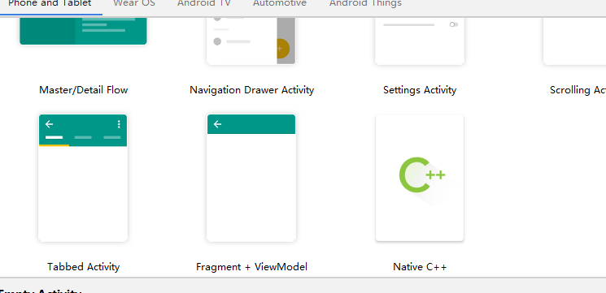
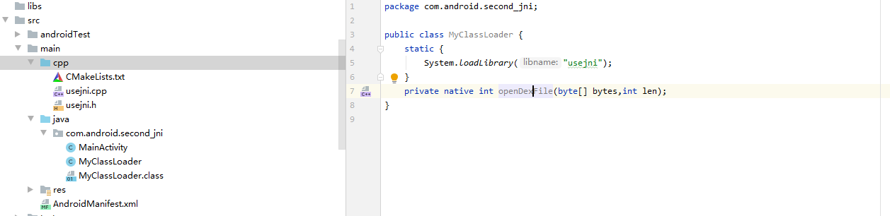
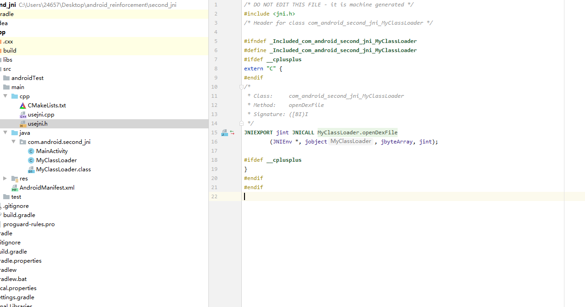
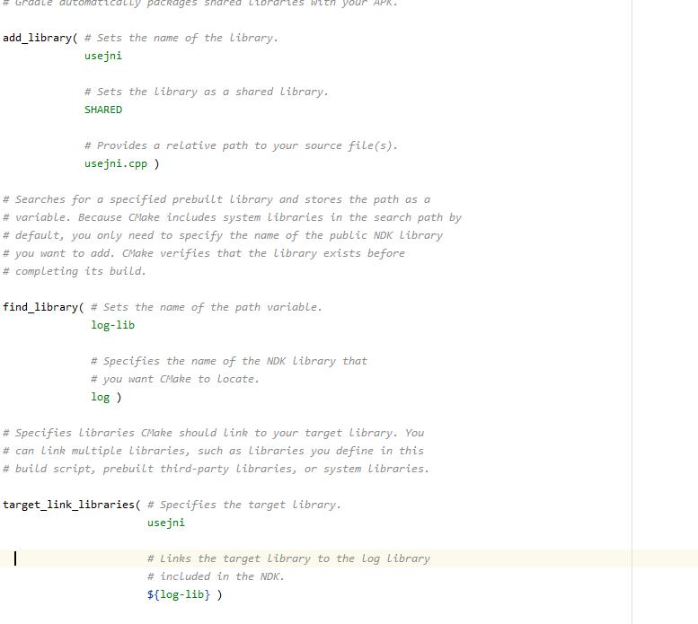

原理部分，前面以及说了关键还是调用opendexfile,loadclass,替换classloader,不过这次我们用c++调用，直接调用原生代码。。

## 实现

主要来说一下jni的创造吧，其他部分见代码，注释应该写的比较清楚吧：）

1.新建项目 选在native c++

将原MainActivity的jni部分和cpp文件夹的native-lib全部删光，新建一个类，命名为MyClassLoader 填充一下代码，同时在cpp文件夹中新建c++ .h

.cpp文件 命名无所谓，我取名为usejni

在java文件中新建终端 javac -h javac -h -jni com/android/second_jni/MyClassLoader.java (网上说的javah 是老老版本的。。当时被它坑了好久)，会多出来一个-jni文件夹，将里面的文件copy到cpp的.h文件

然后修改CMakeLists.txt

然后在cpp的.cpp文件中可以发现sync now ,之后就可以具有编写jni了：）